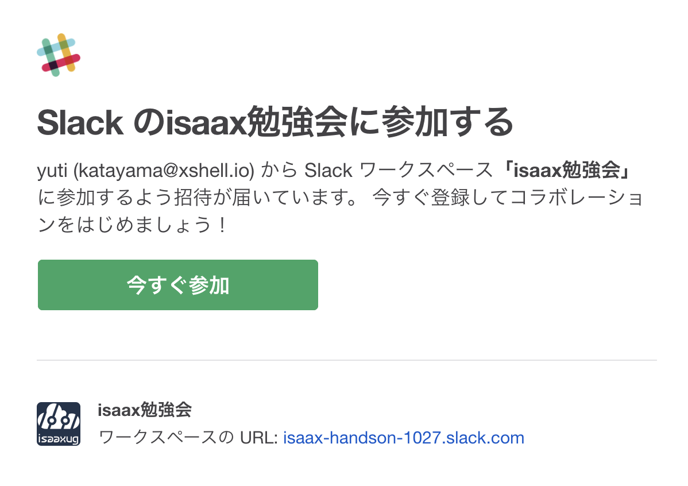
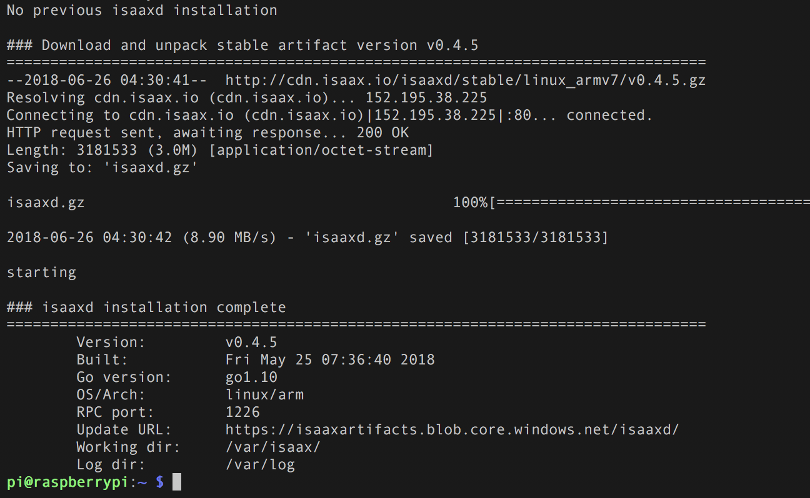
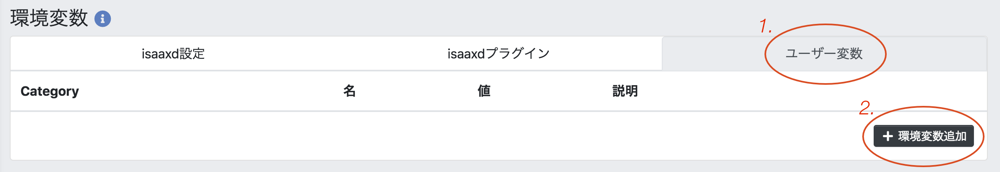

# AIカメラを使ってカウントした人数をクラウドで可視化しよう

この記事は、「Raspberry Pi + Picameraでisaaxをはじめよう」の応用編として、AIカメラのサンプルアプリケーションを使ってカウントした人数とその瞬間の画像キャプチャをSlackに送信するところまでを体験します。ハンズオンでは必要なライブラリがあらかじめインストールされたSDカードを手元に配っているのでそちらを使ってください。新しく用意したSDカードに同様の環境を構築したい場合は記事の最後にある付録を確認してください。

大まかな流れとして、

1. サンプルプログラムをisaaxを使ってインストール
2. GitHub経由でサンプルに画像アップロード機能を追加
3. Slackに画像と共に通知

の順番でハンズオンを進めていきます。


## 用意するもの

このハンズオンで必要となる部材は下記の通りです。


### Raspberry Pi 環境

- Raspberry Pi 2 または 3以上
- SDカード (配布したものを使用)
- Picameraモジュール (v1またはv2)
- 電源 (PCからの給電も可)
- インターネット接続

### PC環境

- SSHが使える環境 (WindowsならTeraTerm, Git Bashなど)
- gitが使える環境
- GitHubアカウント
- isaaxアカウント (後述)
- 勉強会用Slackアカウント (後述)
- インターネット接続

後ほどSSHを行うため、Raspberry PiとPCは同じローカルネットワーク環境下に接続されるようにしてください。


## 勉強会用Slackアカウントの作成

勉強会参加者の方には、あらかじめ今回使うSlackチャンネルへの招待メールをお送りしました。下図のようなメールが届いていれば、「今すぐ参加」からアカウントを作成してログインしてください。



メールが届いていない場合や、アカウントの作成がまだの場合はスタッフにお知らせください。

[isaax勉強会 第19回 Slackワークスペース](https://isaax-handson-1027.slack.com)


## ハンズオンの準備

Raspberry PiにカメラとSDカード、有線接続する場合はLANケーブルを接続し、電源を投入してください。ハンズオンでは電源投入後にIPアドレスを調べます。この時点でRaspberry PiのIPアドレスを控えていない場合は、スタッフをお呼びください。


## サンプルプログラムを動かそう

それでは始めましょう。isaaxを使って人数カウントを行うサンプルプログラムをRaspberry Piにインストールします。GitHubにログインしていない場合は、ここでログインしましょう。


### サンプルコードのフォーク

ブラウザで下記のリンクを開き、右上のForkボタンを押してリポジトリを自分のアカウントにフォークします。

[サンプルコード - GitHub isaaxug/study-picamera-examples](https://github.com/isaaxug/study-picamera-examples)


### isaaxプロジェクトの作成

次に、isaaxにGitHubアカウントを使ってログインします。

[isaax.io - 公式ページ](https://isaax.io/)


isaaxのダッシュボードを開き、「+ 新規プロジェクト追加」からプロジェクトを作成します。


下図のようにプロジェクトを設定し、「保存」をクリックします。


### デバイスの登録

プロジェクトの作成後、下図のような画面が表示されます。プロジェクトトークンはデバイスにisaaxdをインストールする際に必要となります。インストールスクリプトはそのトークンを引数としてisaaxdのインストールをワンコマンド実行するためのスクリプトです。下の方の文字列をコピーしてください。


Raspberry PiにSSH接続します。`<>`は入力しないでください。

```
$ ssh pi@<Raspberry PiのIPアドレス>
```

ログインしたら、コピーした文字列をラズパイ上で実行します。`isaaxd installation complete`が表示されればインストール成功です。




### 動作の確認

ブラウザからRaspberry Piの<IPアドレス>:5000にアクセスするとPicameraの映像が確認できます。このアプリケーションは、フレーム内の人の位置、数を認識し、ログとして人数を出力します。そのログの様子はisaaxのダッシュボードから登録したデバイスのページから確認できます。


## Slackとの連携

現時点で、フレーム内の人数を数えるところまでは成功しています。この情報をSlackに通知するための機能を追加しましょう。


### ファイルアップロード機能の追加

フォークしたリポジトリを自分のPCにクローンし、お好きなエディタを開いてコーディングしていきます。gitを使い慣れていない場合はGitHub上で直接コードを編集してください。編集するファイルは `camera/processor/person_detector.py` です。

はじめに、下記のモジュールを追加します。

```python
from datetime import datetime
import os
import sys
import requests
```

次に、データを指定のSlackチャンネルに送るための情報を環境変数から取得します。それぞれの値の設定は以降のセクションで行います。例外処理として、環境変数が存在しなかった場合はエラーメッセージを表示してプログラムを終了させるようにします。

```python
try:
    SLACK_URL = os.environ['SLACK_URL']
    SLACK_TOKEN = os.environ['SLACK_TOKEN']
    SLACK_CHANNEL = os.environ['SLACK_CHANNEL']
except KeyError as e:
    sys.exit('Couldn\'t find env: {}'.format(e))
```

Slackへのファイルアップロードを行う関数を定義します。`PersonDetector`クラスの前に記述しましょう。

```python
def upload():
    image = { 'file': open('hello.jpg', 'rb') }
    payload = {
        'filename': 'hello.jpg',
        'token': SLACK_TOKEN,
        'channels': [SLACK_CHANNEL],
    }
    requests.post(SLACK_URL, params=payload, files=image)
```

上のコードを順番にみていきます。`image`変数は画像データをディクショナリ型で格納します。組み込み関数`open`の第2引数に渡している'rb'は、バイナリファイルを読み込む際に使用するフラグです。

`payload`変数はSlackのエンドポイントに送るデータの実体です。アップロードする際のファイル名、APIトークン、送り先のチャンネルを含みます。

最後の行はrequestsモジュールを使ったPOSTリクエストです。`SLACK_URL`で指定したURLにリクエストを行います。


それでは、`upload`関数の呼び出し部分を作成します。ここではテストとして、1分ごとにカメラに人が映った場合にキャプチャを作成してアップロードするようにします。

80行目付近のifブロックはカウントが0より大きかった場合にその人数を表示する処理です。このブロック内に上で定義した`upload`関数を呼び出しましょう。

```python
if count > 0:
    print('Count: {}'.format(count))
    upload()
```

1分ごとに画像を送信するために、`PersonDetector`の`__init__`メソッドにデータを送信した時間を保持するための変数を追加します。

```python
def __init__(self, flip = True):
    self.last_upload = time.time() # この行を新しく追加
    self.vs = PiVideoStream(resolution=(800, 608)).start()
    self.flip = flip
    time.sleep(2.0)
```

先ほどのifブロックに戻り、最後にファイルをアップロードしてから60秒経過している場合に処理しているフレームのキャプチャを作成し、送信するように変更します。

```python
if count > 0:
    print('Count: {}'.format(count))
    elapsed = time.time() - self.last_upload
    if elapsed > 60:
        cv2.imwrite('hello.jpg', frame)
        upload()
        self.last_upload = time.time()
```

編集は以上です。最終的なコードの全体像は下記のリンクから確認してください。

[サンプルコード - GitHub](https://github.com/isaaxug/study-picamera-examples/blob/answer-0927/camera/processor/person_detector.py)

変更を終えたら、コミットを作成してリモートリポジトリに反映します。GitHub上で編集した場合はページ下部の「Commit changes」ボタンからコミットを作成できます。リモートリポジトリに変更があると、isaaxは更新通知を受け取り、自動的に先ほど登録したデバイスに対して最新のアプリケーションを配信します。

isaaxのダッシュボードからログを確認してみましょう。下記のようなエラーが表示されるはずです。

```
Couldn't find env: 'SLACK_URL'
```

現時点では、必要な環境変数とその値が存在しないためこのような表示となります。ちなみにこのエラー表示は、環境変数の読み込みと一緒に記述した例外処理が呼び出されています。

以降のセクションで環境変数のセットアップをおこないます。


### 環境変数の追加 (URL、アクセストークン、チャンネル)

更新したサンプルアプリケーションがSlackにデータを送信するために、アップロード先のURLとアクセストークン、そして送り先のチャンネルが必要となります。これらの情報をisaaxのユーザー変数に登録します。

ユーザー変数とはisaaxの機能のひとつで、APIキーのような認証情報や環境によって異なるエンドポイントなど、ハードコーディングしたくないデータを切り分けてデプロイする機能があります。isaaxで登録したこのデータはデバイス上で環境変数としてアクセスできます。

クラスターページから「Cluster Settings」をクリックしてドロップダウンを開きます。


「ユーザー変数」タブから「＋環境変数追加」をクリックします。



先ほど追加したコードでは、アプリケーション内で`SLACK_URL`、`SLACK_TOKEN`、`SLACK_CHANNEL`の3つの環境変数を参照していました。なので、それらと同じ名前で変数を追加します。それぞれの変数の値は下記の通りにしてください。

1. SLACK_URL ... `https://slack.com/api/files.upload`
2. SLACK_TOKEN ... 勉強会用Slackのgeneralチャンネルにて共有します。
3. SLACK_CHANNEL ... テーブルに配布されたチャンネル名


下図のように全部で3つ作成します。


環境変数の追加を反映するために、デバイス上のアプリケーションを再起動します。下図を参考にクラスターページの「restart」ボタンから再起動をおこなってください。


ブラウザでRaspberry Piのカメラ映像を確認しているタブをリロードし、しばらく人数認識をさせましょう。一定時間後、設定したチャンネルに下図のように画像がアップロードされれば成功です（このサンプルアプリケーションでは、ブラウザからRaspberry Piにアクセスしているタイミングのみ画像処理を行うのでタブは開いたままにしておいてください）。


## 時間に余裕がある方は...

下記課題に取り組んでみましょう。

### 課題 1

TODO: 画像の描画に関わる変更を加える


### 課題 2

TODO: Slack APIのペイロードをより使いこなす


## 付録 SDカードのセットアップ

新しくRaspbian liteのOSイメージを焼いたSDカードを使う場合は、以下のライブラリをインストールしてください。

```
$ sudo apt update && sudo apt upgrade
$ sudo apt install python3-pip

$ pip3 install picamera numpy opencv-python flask

$ sudo apt install libatlas-base-dev
$ sudo apt install libwebp6 libtiff5-dev libjasper-dev
$ sudo apt install libopenexr22 libilmbase12
$ sudo apt install libgstreamer1.0-dev
$ sudo apt install libavcodec-dev libavformat-dev libswscale-dev
$ sudo apt install libqtgui4 libqt4-test
```

下記のコマンドを実行して、`opencv-python`が使える状態になっていることを確認します。バージョン番号が表示されれば正しくインストールされています。

```
$ python3 -c "import cv2; print(cv2.__version__)"
3.4.2
```
